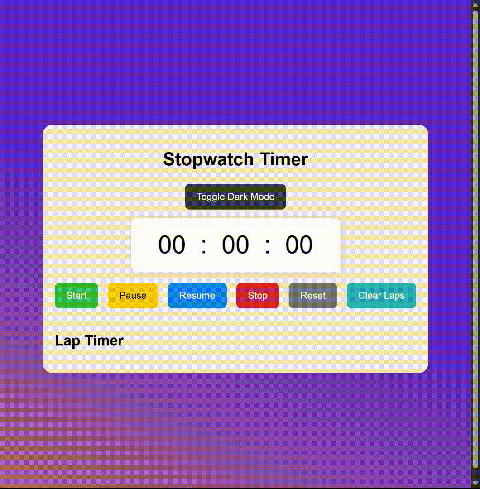

## Stopwatch Timer Application ⏱️

This project is a modern stopwatch timer application. It offers essential stopwatch features like starting, pausing, resuming, resetting, and saving lap times — all wrapped in a clean, responsive design with dark mode support.

## 🚀 Features

- **Start the Timer**: Begin counting time with a single click. ⏱️
- **Pause the Timer**: Temporarily halt the timer without resetting. ⏸️
- **Resume the Timer**: Continue from where you left off. ▶️
- **Stop the Timer**: Stop and log the time as a lap. ⏹️
- **Lap Recording**: Save and display lap times during a session. 🏁
- **Delete Laps**: Remove individual laps or clear all with ease. ❌
- **Dark Mode**: Toggle between light and dark themes. 🌙
- **Responsive Design**: Optimized for mobile, tablet, and desktop. 📱

## 🛠️ Technologies Used

- **HTML**: Defines the structure of the application. 🏗️
- **CSS**: Styles the layout and appearance. 🎨
- **JavaScript**: Adds interactive stopwatch functionality. 🖥️

## 📱 Responsive Design

The Stopwatch Timer app is fully responsive and provides a smooth, consistent experience across all devices — whether you're on a phone, tablet, or desktop. 📐

## 🔍 Preview

